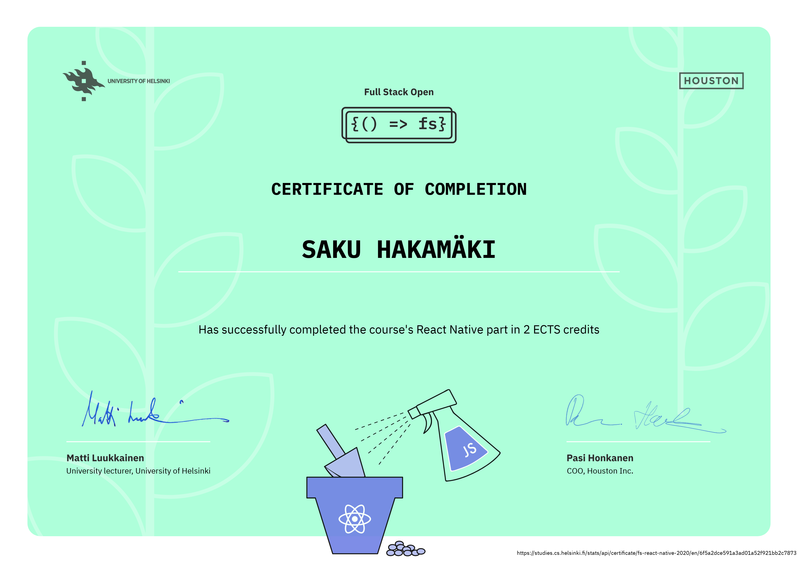

# FSO22

---

## General information:

#### My task submissions related to [Full Stack Open](https://fullstackopen.com/) -course offered by University of Helsinki.

#### As of Tuesday the 27th of September 2022:

|         Name         | Part(s) | ECTS |   Status   |
| :------------------: | :-----: | :--: | :--------: |
|   The Core Course    |   0-7   |  7   | Submitted. |
|       GraphQL        |    8    |  1   | Submitted. |
|      TypeScript      |    9    |  1   | Submitted. |
|     React Native     |   10    |  2   | Submitted. |
|       CI / CD        |   11    |  1   | Submitted. |
|      Containers      |   12    |  1   | Submitted. |
| Relational Databases |   13    |  1   | Submitted. |

---

## Certificates:

|         Name         |                                                                                                                                 Link(s)                                                                                                                                 |                                   Image                                   |
| :------------------: | :---------------------------------------------------------------------------------------------------------------------------------------------------------------------------------------------------------------------------------------------------------------------: | :-----------------------------------------------------------------------: |
|   The Core Course    |        Certificate in [English](https://studies.cs.helsinki.fi/stats/api/certificate/fullstackopen/en/4ed588fd12ab21307b935fbb728cc610) or in [Finnish](https://studies.cs.helsinki.fi/stats/api/certificate/fullstackopen/fi/4ed588fd12ab21307b935fbb728cc610).        |  |
|       GraphQL        |                                                                     Certificate in [English](https://studies.cs.helsinki.fi/stats/api/certificate/fs-graphql/en/ba2a118678313976a39688bcf4828ede).                                                                      |               |
|      TypeScript      |                                                                    Certificate in [English](https://studies.cs.helsinki.fi/stats/api/certificate/fs-typescript/en/b7cf4cceca29519112b8bfc8589e337b).                                                                    |         |
|     React Native     | Certificate in [English](https://studies.cs.helsinki.fi/stats/api/certificate/fs-react-native-2020/en/6f5a2dce591a3ad01a52f921bb2c7873) or in [Finnish](https://studies.cs.helsinki.fi/stats/api/certificate/fs-react-native-2020/fi/6f5a2dce591a3ad01a52f921bb2c7873). |   |
|       CI / CD        |              Certificate in [English](https://studies.cs.helsinki.fi/stats/api/certificate/fs-cicd/en/56ca23c2bd56cb63b44013c417098c69) or in [Finnish](https://studies.cs.helsinki.fi/stats/api/certificate/fs-cicd/fi/56ca23c2bd56cb63b44013c417098c69).              |                 |
|      Containers      |                                                                    Certificate in [English](https://studies.cs.helsinki.fi/stats/api/certificate/fs-containers/en/c667616edc18acfa57cfcc2df7734ec1).                                                                    |         |
| Relational Databases |              Certificate in [English](https://studies.cs.helsinki.fi/stats/api/certificate/fs-psql/en/70a1f429de2af22c2956058171349b3f) or in [Finnish](https://studies.cs.helsinki.fi/stats/api/certificate/fs-psql/fi/70a1f429de2af22c2956058171349b3f).              |            |

---
