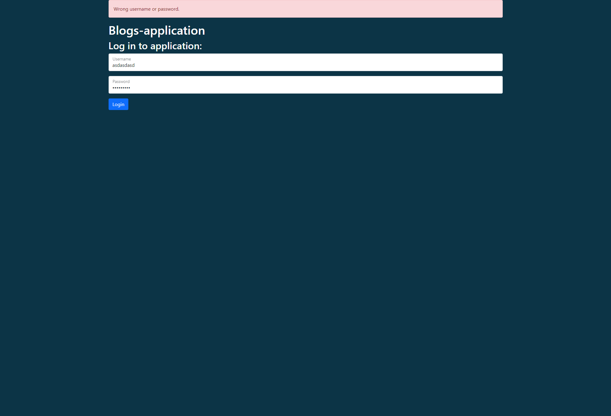
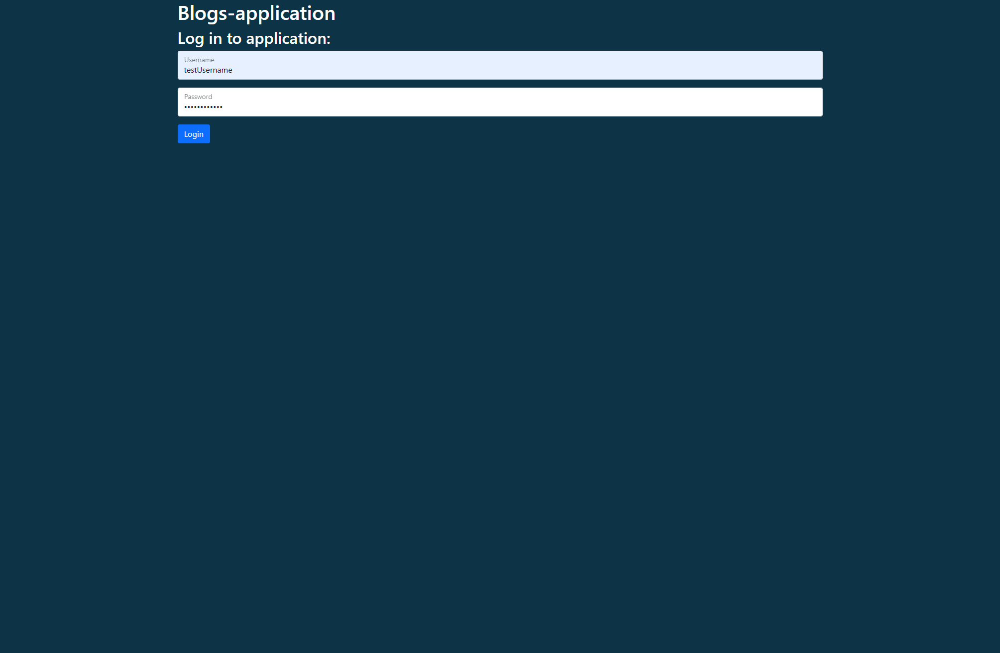
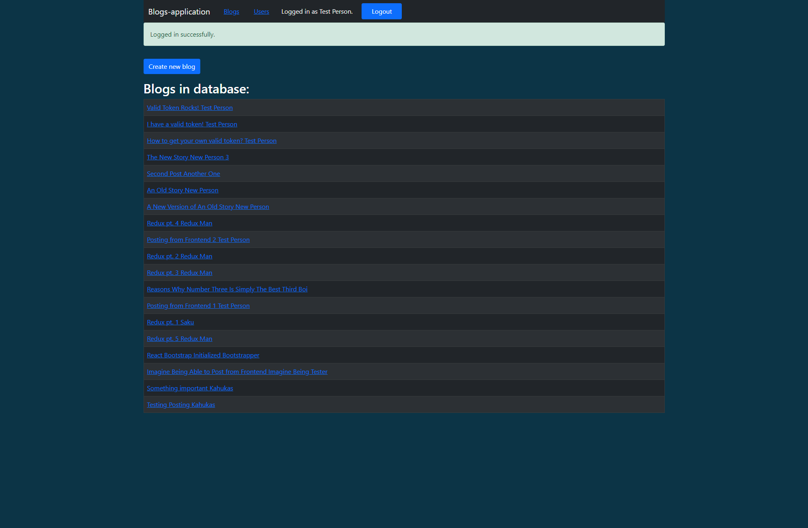
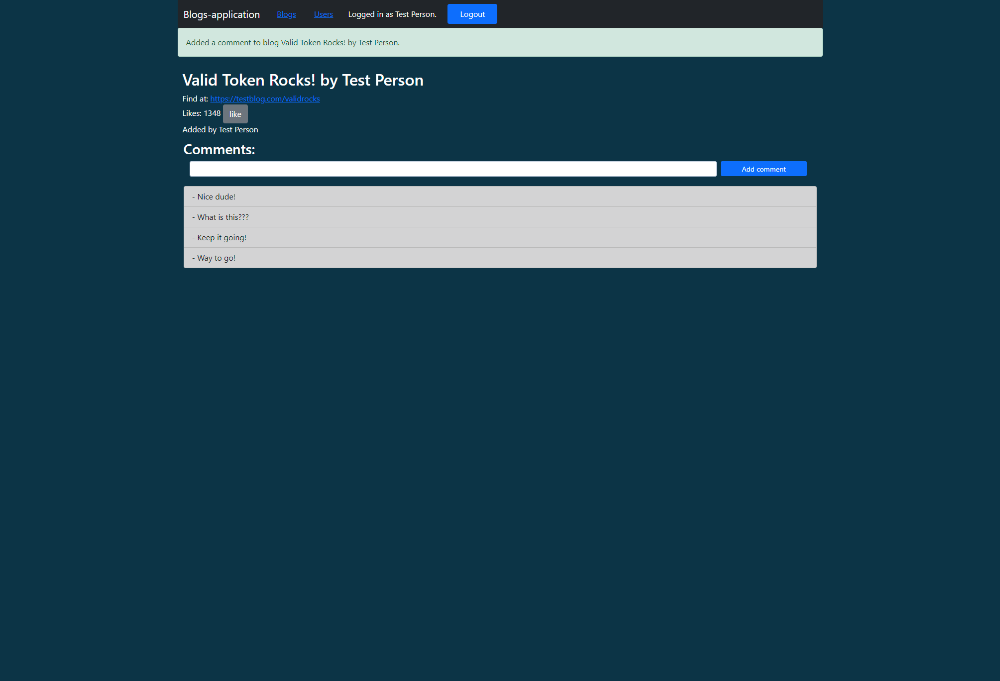
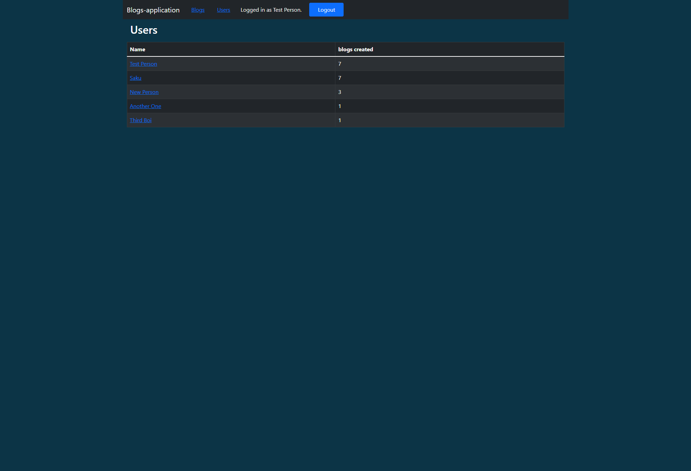
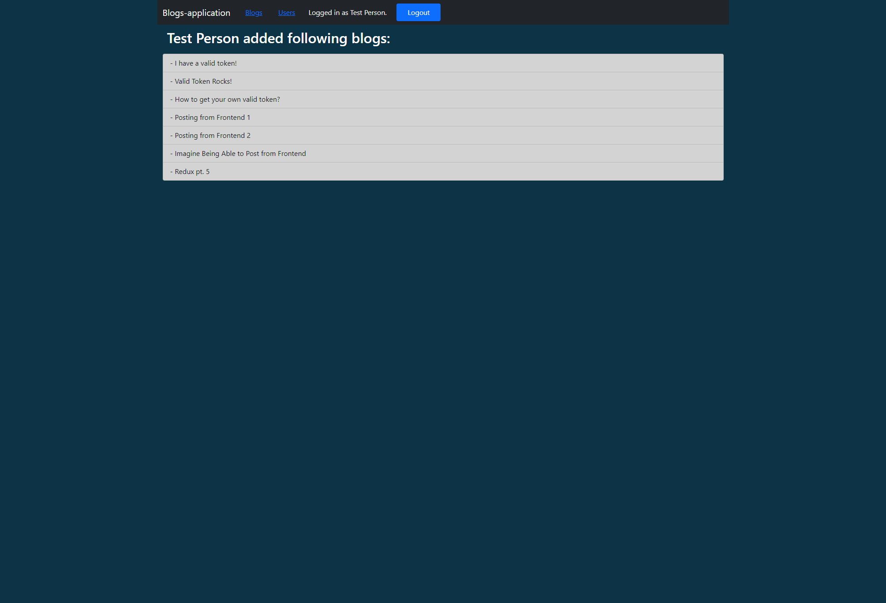
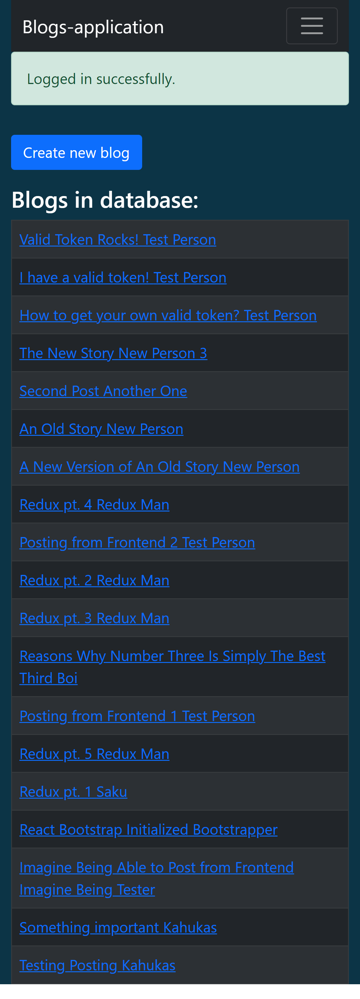
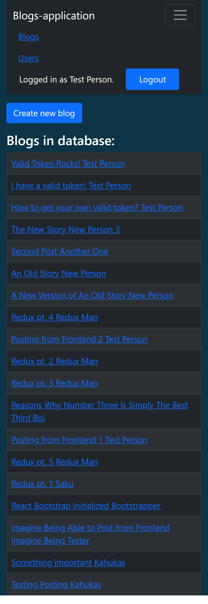

# Full Stack Blogs-application

---

## Screenshots:

Screenshot of log in -view with invalid credentials.

Screenshot of log in -view with valid credentials.

Screenshot of the home-view after login.

Screenshot of the individual blog -view after adding a comment.

Screenshot of the users -view.

Screenshot of the view with listing of blogs added by user.

Screenshot of the log in -view after logout.

Screenshot of the home-view after login with a mobile device.

Screenshot of the collapsed navigation bar in the home-view with a mobile device.

